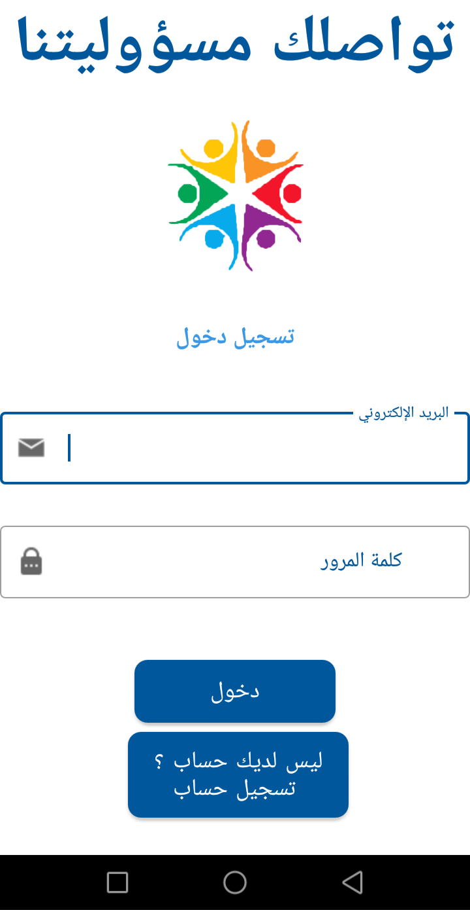
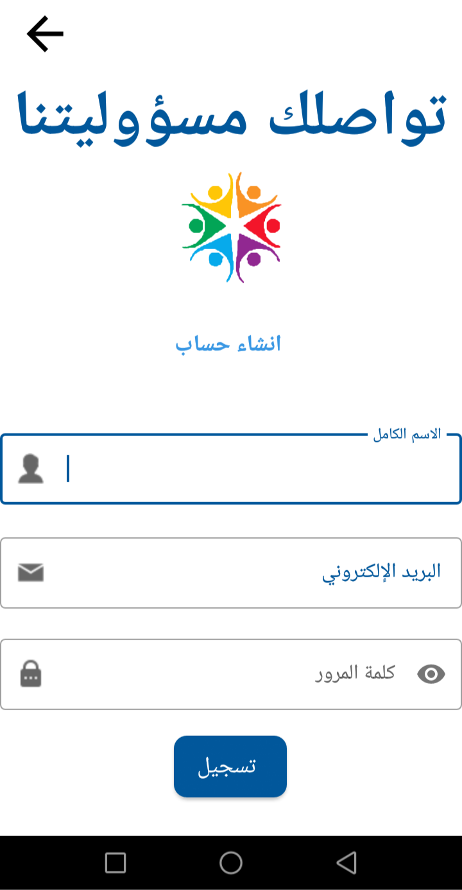
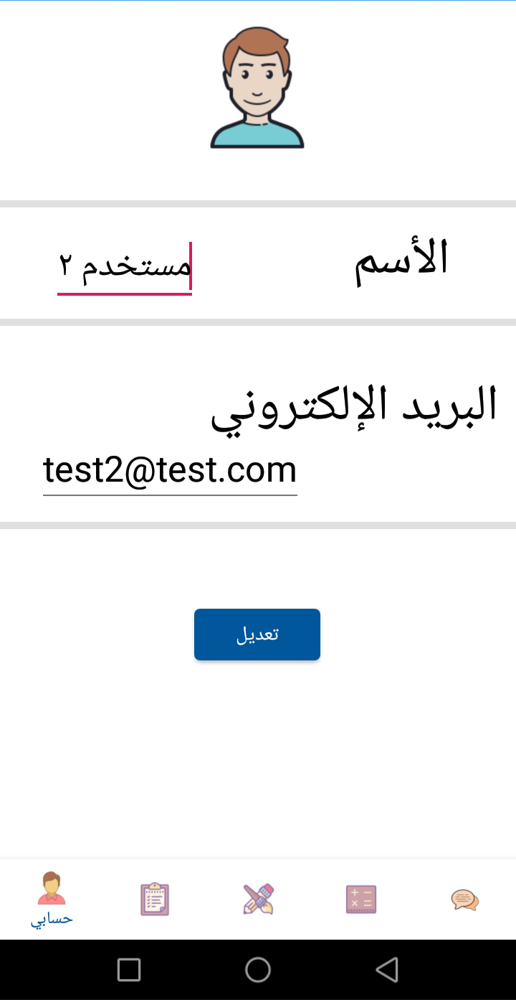
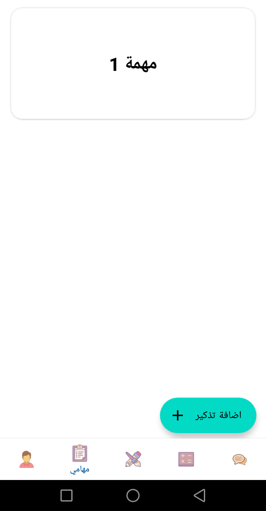
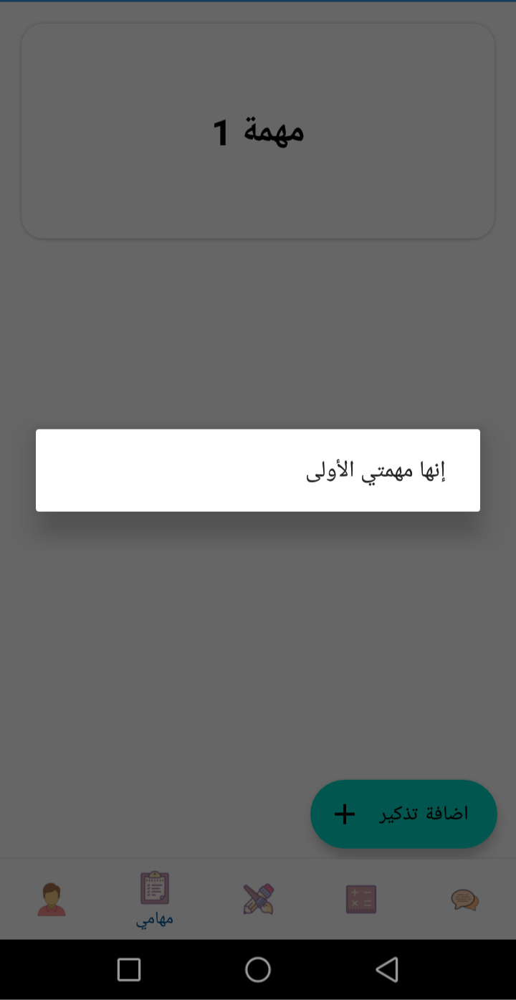
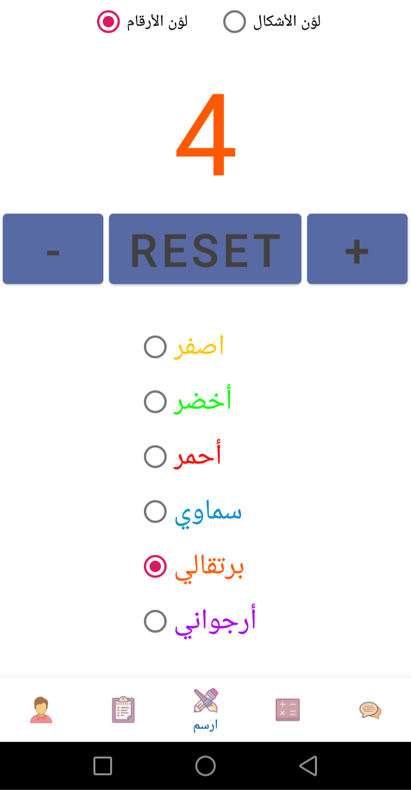
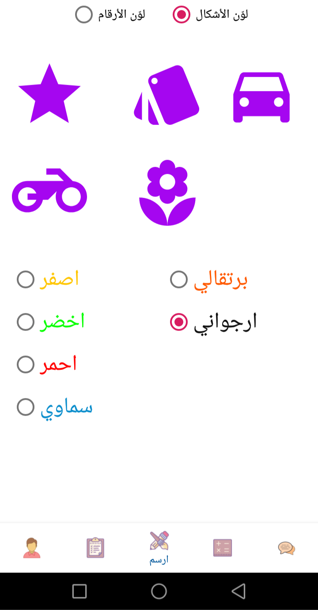
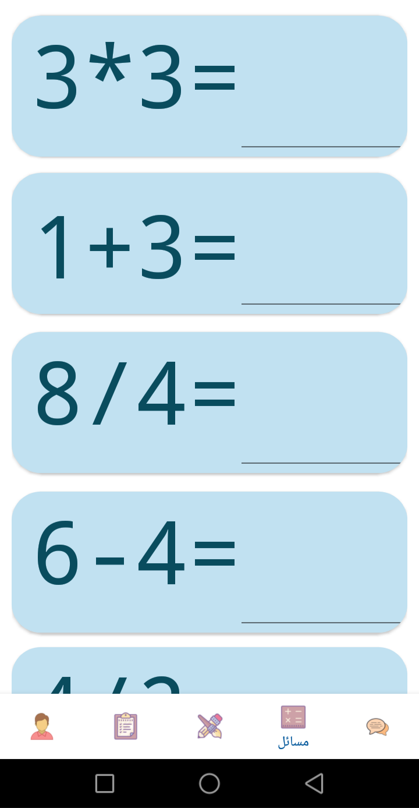
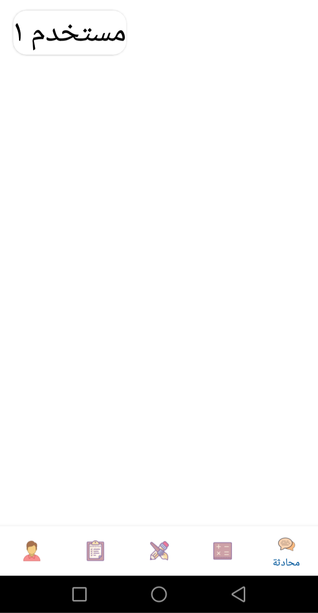
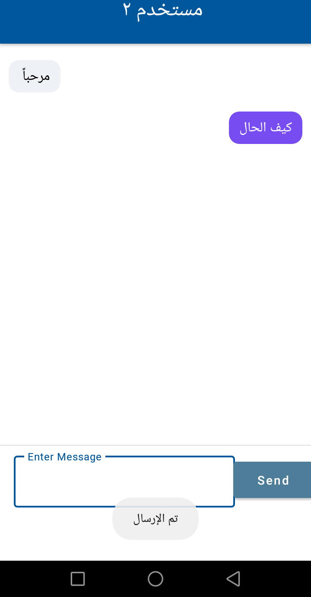

<h1 align="center">Task management application</h1>

  
Table of Contents

  <ol>
    <li>
      <a href="#Introduction">Introduction & Functionality</a>
    </li>
    <li>
        <a href="#Screenshot">Screenshot</a>
    </li>
  </ol>

## Introduction & Functionality
- This is a simple task management application built in android(native java).
- This application provide the user with the following features:
  - Create and manage your account.
  - Add, view, update, and delete your tasks.
  - A drawing page that helps kids to learn counting and coloring.
  - A problem page that help kids to learn some basic math operation.
  - A simple chat application.

## Screenshot

* Loading Screen
  
&nbsp;
* Login page
  
&nbsp;
* Sign up page
  
&nbsp;
* Profile page
  
&nbsp;
* Task page 1
  
&nbsp;
* Successfully adding a new task
  
&nbsp;
* Drawing page 1
  
&nbsp;
* Drawing page 2
  
&nbsp;
* Problems page
  
&nbsp;
* Chat page 1
  
&nbsp;
* Chat page 2
  